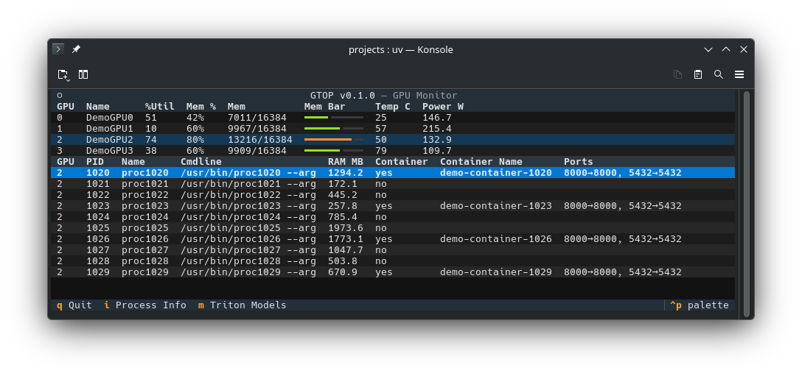
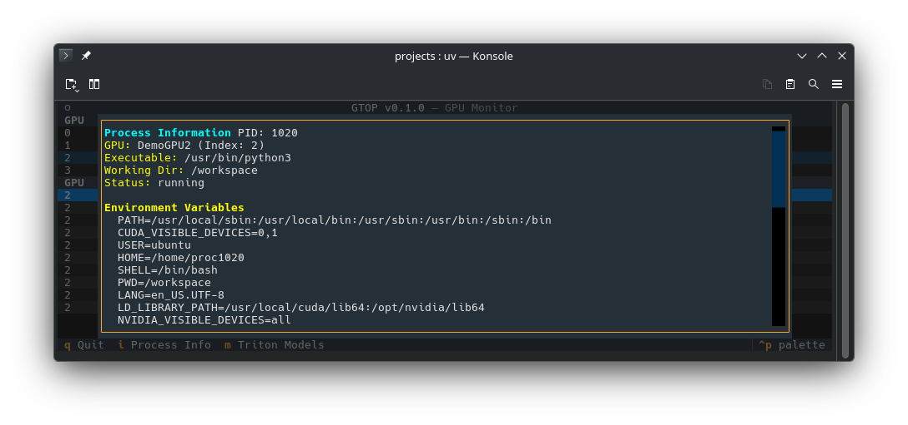
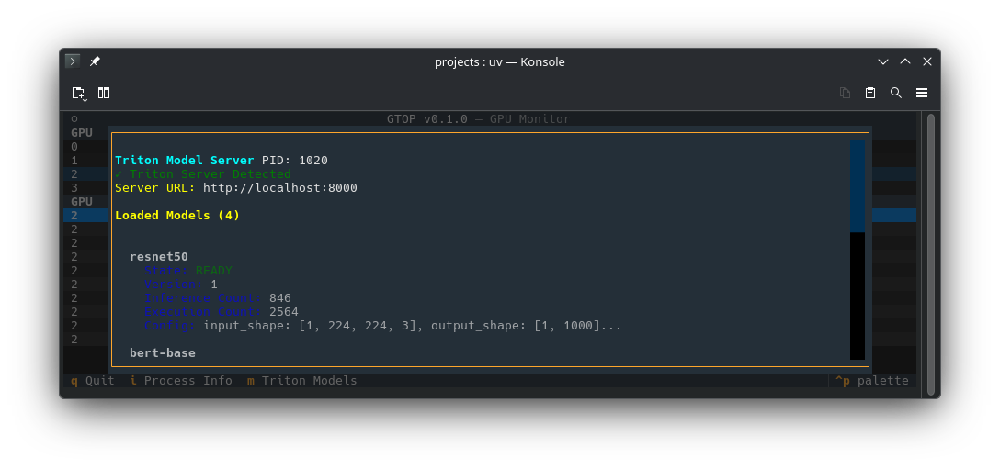

# GTOP - GPU Monitoring TUI

A powerful terminal user interface (TUI) for real-time GPU monitoring and process management. Monitor NVIDIA GPUs, visualize memory usage, track resource-consuming processes, and detect containerized workloads—all from the command line.

## Features

- 🚀 **Real-time GPU Monitoring**: Display GPU utilization, memory usage, temperature, and power consumption
- 📊 **Process Tracking**: See all GPU-related processes with memory usage and command-line arguments
- 🐳 **Container Detection**: Automatically identify Docker containers using GPUs and display container names and port mappings
- 🎨 **Visual Indicators**: Color-coded memory usage progress bars (green < 75%, yellow < 90%, red ≥ 90%)
- 📋 **Detailed Process Info**: Press `i` to view detailed information including environment variables, open files, and network connections
- 🤖 **Triton Server Integration**: Detect NVIDIA Triton servers and inspect loaded models, inference statistics, and deployment status
- 🎮 **Interactive Navigation**: Keyboard-driven interface with intuitive controls
- 🧪 **Demo Mode**: Test the TUI without GPU hardware using synthetic data
- 📤 **JSON Export**: Query GPU metrics and export data as JSON for integration with other tools

## Requirements

- Python 3.11 or later
- NVIDIA GPU with CUDA support (or use `--demo` mode for testing)
- Linux operating system (requires `/proc` filesystem for process introspection)

## Installation

### Using uv (Recommended)

```bash
git clone <repository-url>
cd gtop
uv sync            # installs dependencies into current environment
```

*The project targets Python 3.13; ensure your environment is using that interpreter.*

The only installation tool required is `uv`; `pip` is not used directly.


## Usage

### Basic Usage

When installed in an environment with `uv` you can also run via `uvx`:

```bash
uvx gtop
```

This wrapper ensures the right interpreter is used and mirrors how the package is invoked after installation.





Start monitoring your GPUs:

```bash
python main.py
```

Or if installed as a package:

```bash
gtop
```

### Demo Mode

Test the TUI with simulated GPU data and comprehensive demo features:

```bash
python main.py --demo
```

**Demo Mode Includes:**
- **4 Synthetic GPUs**: With realistic utilization, memory, temperature, and power metrics
- **40 Simulated Processes**: 10 processes per GPU (at GPU indices 1000-1039)
- **Container Simulation**: ~33% of demo processes run in Docker containers with fake names and port mappings
- **Process Details**: Each process includes:
  - Fake environment variables (CUDA_VISIBLE_DEVICES, PYTHONUNBUFFERED, etc.)
  - Open file descriptors (device files, logs, model configs)
  - Network connections (TCP sockets, listening ports, established connections)
- **Triton Server Support**: Certain demo processes (PIDs ending in 5) simulate NVIDIA Triton servers with:
  - 4 pre-loaded models (ResNet-50, BERT, YOLOv8, GPT-Neo)
  - Realistic model states and inference statistics
  - Server URLs and configuration details

**Testing the Demo:**
```bash
# View GPU and process data
python main.py --demo

# Tab to process table, select a process (PID 1005, 1010, 1015, etc.), press 'm' for Triton models
# Press 'i' on any process to see detailed environment variables, files, and connections
# Export complete demo data as JSON
python main.py --demo --query | jq .

#### Docker Usage

A `Dockerfile` is included for container builds. On a host with NVIDIA GPUs (NVIDIA Container Toolkit required):

```bash
# build the image
docker build -t stivio00/gtop .

# run with GPUs attached
docker run --gpus all -it stivio00/gtop

# run explicitly in demo mode
docker run -it stivio00/gtop --demo
```

The image installs the package and defaults to `gtop --demo`. Mount volumes or pass additional flags as needed.

### JSON Export

Export GPU and process data as JSON (useful for scripting and integration):

```bash
python main.py --query
python main.py --demo --query
python main.py -q  # Short form
```

**Example output (first GPU only)**:
```json
{
  "gpus": [
    {
      "index": 0,
      "name": "NVIDIA A100",
      "util": 45,
      "mem_used": 8192,
      "mem_total": 40960,
      "temp": 55,
      "power": 120.5
    }
  ],
  "processes": {
    "0": [
      {
        "gpu_index": 0,
        "pid": 12345,
        "name": "python",
        "cmdline": "python train.py --model large",
        "mem_mb": 4096.5,
        "container": true,
        "container_name": "pytorch-training",
        "container_ports": "8888→8888, 6006→6006"
      }
    ]
  }
}
```

## Keyboard Controls

| Key       | Action                    |
|-----------|---------------------------|
| `q`       | Quit the application      |
| `↑ / ↓`   | Navigate GPU table        |
| `Tab`     | Switch to process table   |
| `i`       | Show detailed process info|
| `m`       | Show Triton models (if running) |
| `Esc` / `q` (in modals) | Close modal window |

**Scrolling in Modal Windows:**
- **Page Up / Page Down** - Scroll by page
- **Arrow Up / Arrow Down** - Scroll line by line
- **Home / End** - Jump to top/bottom of content

## Interactive Features

### GPU Table
- View all NVIDIA GPUs with real-time metrics
- Memory usage shown as both percentage and GB with colored progress bar
- GPU temperature and power consumption updates every second

### Process Table
- Lists all processes currently using the selected GPU
- Shows process name, PID, memory usage, and command-line arguments
- Indicates which processes are running in Docker containers
- Displays container name and port mappings

### Process Detail Modal
- Press `i` on a selected process to view comprehensive details
- Display information:
  - Process executable path and working directory
  - Process status (running, sleeping, etc.)
  - Environment variables (first 20 shown)
  - Open file descriptors
  - Network connections (local and remote addresses)
  - GPU model name
- Close with `q` or `Esc`

### Triton Models Modal
- Press `m` on a selected process running NVIDIA Triton to view model information
- Shows:
  - Server detection status and connection URL
  - Loaded model names and versions
  - Model states (READY, LOADING, etc.)
  - Inference and execution statistics
  - Model configurations
- Automatically detects Triton servers in containers and on standalone processes
- Close with `q` or `Esc`

## Dependencies

| Package | Version | Purpose |
|---------|---------|---------|
| `textual` | >=8.0.0 | Terminal user interface framework |
| `rich` | (via Textual) | Colored output and formatting |
| `nvidia-ml-py` | >=13.590.48 | NVIDIA GPU monitoring via NVML |
| `pydantic` | >=2.12.5 | Data validation and models |
| `psutil` | >=5.9.0 | Process information and system utilities |
| `docker` | >=7.0.0 | Docker container detection |
| `tritonclient` | >=2.30.0 | NVIDIA Triton server client |

## Architecture

The codebase is organized into focused modules:

- **models.py**: Pydantic data models for GPU stats and processes
- **gpu.py**: GPU statistics retrieval from NVIDIA NVML
- **process.py**: GPU process enumeration and container detection
- **docker_util.py**: Docker SDK wrapper for container metadata
- **process_info.py**: Process introspection (environment, files, connections)
- **process_screen.py**: Textual modal screen for detailed process information
- **triton_util.py**: Triton server detection and client for model inspection
- **triton_screen.py**: Textual modal screen for Triton model information
- **ui.py**: Main Textual application and UI logic
- **demo.py**: Synthetic data generation for testing
- **main.py**: Entry point and CLI argument parsing

## Troubleshooting

### Module not found errors
Ensure all dependencies are installed:
```bash
uv sync
# or
pip install -r requirements.txt
```

### Permission denied accessing processes
Some process details require elevated privileges. Run with `sudo` for full information:
```bash
python main.py
```

### Docker connection issues
The app gracefully handles Docker SDK errors. If container detection fails, processes will still display—just without container information.

## Development

The repository includes a GitHub Actions workflow (`.github/workflows/publish.yml`) that automatically publishes to PyPI and builds a Docker image whenever code is pushed to `master`/`main` or the workflow is triggered manually. You should set the following secrets in your GitHub repo:

- `PYPI_TOKEN` (PyPI API token)
- `DOCKER_USERNAME` / `DOCKER_PASSWORD`


The project is hosted on GitHub under the user **stivio00**: https://github.com/stivio00/gtop

A simple `Makefile` is included for common tasks:

```bash
make install-dev   # install build/test/lint tools
make build         # build sdist and wheel
make upload        # build and upload to PyPI (set TWINE_USERNAME/TWINE_PASSWORD)
make clean         # remove build artifacts
make lint          # run flake8
make format        # run black
```

### Running tests
```bash
python main.py --demo --query  # Verify demo mode and JSON export
```

### Code organization
The modular structure makes it easy to:
- Add new metrics (extend `models.py` and `gpu.py`)
- Support additional container runtimes (enhance `docker_util.py`)
- Customize UI appearance (modify `ui.py` CSS)

## License

MIT License

## Author

Stephen Krol

## Contributing

Contributions are welcome! Feel free to open issues and pull requests.
